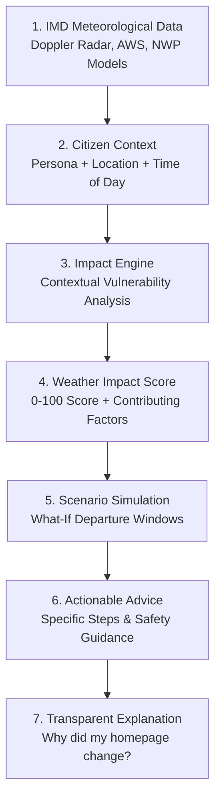

# MAUSAM IQ — Detailed Project Workflow & Architecture Document
### Organization: Ministry of Earth Sciences (MoES) / India Meteorological Department (IMD)
### Project: Development of Personalized Homepage for 'Mausam' Mobile Application
### Hackathon: Smart India Hackathon (SIH) Prototype Specification

---

## 📑 Table of Contents
1. [Executive Summary & Problem Statement](#1-executive-summary--problem-statement)
2. [Core Product Philosophy: The 7-Stage Intelligence Loop](#2-core-product-philosophy-the-7-stage-intelligence-loop)
3. [End-to-End System Workflow Diagram](#3-end-to-end-system-workflow-diagram)
4. [Detailed Workflow Stages](#4-detailed-workflow-stages)
   - [Stage 1: Meteorological Ingestion & Trust Calibration](#stage-1-meteorological-ingestion--trust-calibration)
   - [Stage 2: Citizen Context & Persona Disambiguation](#stage-2-citizen-context--persona-disambiguation)
   - [Stage 3: Weather Intelligence & Contextual Impact Scoring](#stage-3-weather-intelligence--contextual-impact-scoring)
   - [Stage 4: "What If?" Scenario Simulation](#stage-4-what-if-scenario-simulation)
   - [Stage 5: Route Micro-Climate Checkpoint Engine](#stage-5-route-micro-climate-checkpoint-engine)
   - [Stage 6: Dynamic Card Ranking & Homepage Adaptation](#stage-6-dynamic-card-ranking--homepage-adaptation)
   - [Stage 7: Transparent Explanation Layer ("Why did my homepage change?")](#stage-7-transparent-explanation-layer)
   - [Stage 8: Conversational Mausam AI Copilot](#stage-8-conversational-mausam-ai-copilot)
   - [Stage 9: Personal Weather DNA & Data Sovereignty](#stage-9-personal-weather-dna--data-sovereignty)
5. [Screen-by-Screen User Journey](#5-screen-by-screen-user-journey)
6. [Data Flow & Technical Component Mapping](#6-data-flow--technical-component-mapping)
7. [Offline Caching & Network Resilience Flow](#7-offline-caching--network-resilience-flow)
8. [Guide for Evaluators & Live Demonstration](#8-guide-for-evaluators--live-demonstration)

---

## 1. Executive Summary & Problem Statement

### The Problem
Traditional weather applications present passive, scientific numbers:
> *"Precipitation: 78% • Wind: 28 km/h • Humidity: 84% • Barometric Pressure: 1008 hPa"*

For ordinary citizens—whether a farmer in Karnal, a daily commuter on the Delhi-Gurugram expressway, an asthmatic patient in an urban centre, or a fisherman in Kochi—raw numbers fail to answer the essential question:
**"What does this weather mean for my life, my work, and what should I do right now?"**

### The Solution: Mausam IQ
Mausam IQ transforms the official India Meteorological Department (IMD) platform from an observational data feed into a **Personalized Weather Intelligence Platform**.

It shifts the paradigm from:
$$\text{RAW DATA} \longrightarrow \text{WEATHER} \longrightarrow \text{PERSONAL CONTEXT} \longrightarrow \text{IMPACT} \longrightarrow \text{SCENARIO} \longrightarrow \text{ACTION}$$

---

## 2. Core Product Philosophy: The 7-Stage Intelligence Loop

Every atmospheric reading passes through a 7-stage deterministic transformation pipeline:



---

## 3. End-to-End System Workflow Diagram

```
+---------------------------------------------------------------------------------------+
|                                1. DATA INGESTION LAYER                                |
|  - IMD Palam Doppler Radar (reflectivity / dBZ)                                      |
|  - MoES High-Resolution WRF Numerical Weather Prediction (NWP) Models                 |
|  - Surface Automatic Weather Stations (AWS Mesonet)                                   |
|  - INCOIS Marine Buoy Network (Wave Swell & Coastal Winds)                           |
+-------------------------------------------+-------------------------------------------+
                                            |
                                            v
+---------------------------------------------------------------------------------------+
|                                2. CONTEXT & STATE LAYER                               |
|  - Active Persona (Farmer, Commuter, Traveller, Student, Outdoor, Health, Fisherman)  |
|  - Saved Locations (Home, Office, Village, Farm, Family Hubs)                         |
|  - Personal Weather DNA (Sensitivity weights for Rain, Temp, AQI, Commute, Agri)      |
|  - Device Environment (Screen width: Mobile vs Desktop, Network: Online vs Offline)   |
+-------------------------------------------+-------------------------------------------+
                                            |
                                            v
+---------------------------------------------------------------------------------------+
|                           3. WEATHER INTELLIGENCE ENGINES                             |
|  +--------------------------------+  +---------------------------------------------+  |
|  |       impactEngine.ts          |  |          personalizationEngine.ts           |  |
|  | - Factual Weather vs AI Impact |  | - Priority Card Re-ranking (Severe Alert #1)|  |
|  | - Contextual Score (0 to 100)  |  | - Transparent Trigger Explanation Generator |  |
|  | - Factor Breakdown (Rain/Wind) |  | - Persona Domain Feed Customizer            |  |
|  +--------------------------------+  +---------------------------------------------+  |
|  +--------------------------------+  +---------------------------------------------+  |
|  |         routeEngine.ts         |  |               aiAssistant.ts                |  |
|  | - Micro-Climate Checkpoints    |  | - Grounded Natural Language Weather Q&A     |  |
|  | - Highway Waterlogging Hazards |  | - Zero-Hallucination IMD Ground Data Filter |  |
|  | - "What-If" Departure Windows  |  | - Contextual Persona Prompt Suggestions     |  |
|  +--------------------------------+  +---------------------------------------------+  |
+-------------------------------------------+-------------------------------------------+
                                            |
                                            v
+---------------------------------------------------------------------------------------+
|                                4. USER INTERACTION LAYER                              |
|  - Responsive Header (IMD Crest, Live Radar Pulse, Location Pill, Persona Selector)   |
|  - Mobile View: Dynamic Card Feed + Touch Bottom Navigation                           |
|  - Desktop View: Centered Feed (max-width: 780px) + Radar Telemetry Side Panel        |
|  - Bilingual Engine: Full Instant Switching between English and हिन्दी                |
+---------------------------------------------------------------------------------------+
```

---

## 4. Detailed Workflow Stages

### Stage 1: Meteorological Ingestion & Trust Calibration
1. **Data Freshness Tracker**: Tracks timestamp deltas from the last Doppler radar sweep.
2. **Forecast Trust Metric**: Assigns an explicit **Confidence Score (0–100%)** based on ensemble model agreement (e.g., *92% Consensus across 4 NWP Models*).
3. **Data Source Attribution**: Cites official governmental scientific infrastructure (e.g., *IMD Regional Meteorological Centre, New Delhi*).
4. **Distinction Boundary**: Clear separation between factual raw data and application-modeled intelligence.

### Stage 2: Citizen Context & Persona Disambiguation
When a user launches the app or switches personas, the active context re-calibrates:
- **Farmer (किसान)**: Prioritizes soil moisture saturation, 48-hour pesticide spraying windows, humidity, and frost/squall warnings.
- **Commuter (दैनिक यात्री)**: Prioritizes arterial road visibility, waterlogged underpass hazards, and departure time buffers.
- **Traveller (यात्री)**: Prioritizes highway corridors, crosswind hazards, and airport/railway weather delays.
- **Student (विद्यार्थी)**: Prioritizes campus rain probability, umbrella reminders, and outdoor sports feasibility.
- **Outdoor / Sports User**: Prioritizes Wet Bulb Globe Temperature (WBGT) heat index, UV Index, and morning vs evening running hours.
- **Health-Sensitive User**: Prioritizes PM2.5 / PM10 particulate pollution, high humidity dampness, and respiratory precautions.
- **Fisherman (मछुआरा)**: Prioritizes coastal wind velocity, wave heights, and INCOIS deep-sea venturing bans.

### Stage 3: Weather Intelligence & Contextual Impact Scoring
- Located in `src/services/impactEngine.ts`.
- Computes a mathematical **Weather Impact Score** from $0$ to $100$:
  $$\text{Impact Score} = \frac{\sum (\text{RiskFactor}_i \times \text{Weight}_i)}{\sum \text{Weight}_i}$$
  - For Commuters: Heavily weights rain ($40\%$), visibility ($25\%$), and wind ($20\%$).
  - For Farmers: Heavily weights rain ($35\%$), soil moisture/humidity ($35\%$), and temperature ($20\%$).
  - For Fishermen: Heavily weights marine wind ($45\%$) and wave swell ($35\%$).
- Displays the **Contributing Factors Breakdown** directly in the UI.
- Clicking *"Why is my score high?"* opens a transparent algorithmic modal explaining the exact formula.

### Stage 4: "What If?" Scenario Simulation
- Located in `src/services/routeEngine.ts` and `src/components/WhatIfSimulatorCard.tsx`.
- Allows users to test four departure scenarios:
  1. **Leave Now (Current Window)**: Shows active squalls and waterlogging building up.
  2. **Wait +1 Hour**: Shows peak convective thunderstorm cell overhead with high lightning risk (Delay Risk: High).
  3. **Wait +2.5 Hours**: Shows storm cell dissipating eastwards with light drizzle (Delay Risk: Low).
  4. **Tomorrow Morning**: Shows clear morning conditions and dry road corridors.
- Visual comparative bars clearly indicate rain risk and delay probabilities.

### Stage 5: Route Micro-Climate Checkpoint Engine
- Located in `src/components/RouteWeatherCard.tsx`.
- Users enter an Origin (e.g. *Connaught Place, Delhi*) and Destination (e.g. *Cyber City, Gurugram*).
- System breaks the journey down into micro-climate checkpoints:
  - Checkpoint 1: *Connaught Place (0 km)* — 31°C, Overcast, 65% Rain.
  - Checkpoint 2: *Dhaula Kuan Flyover (9.2 km)* — 30°C, Heavy Downpour, 34 km/h gusts (Caution: Flyover crosswinds).
  - Checkpoint 3: *Mahipalpur Underpass (18.5 km)* — 29°C, Low Visibility, 92% Rain (Hazard: Underpass water pooling).
  - Checkpoint 4: *Sirhaul Toll Border (24.8 km)* — 30°C, Moderate Rain, 78% Rain.
  - Checkpoint 5: *Cyber City (31.4 km)* — 30°C, Light Showers, Sheltered approach.

### Stage 6: Dynamic Card Ranking & Homepage Adaptation
- Located in `src/services/personalizationEngine.ts`.
- Evaluates active meteorological conditions and outputs a sorted list of card components:
  1. If any **Orange or Red Alert** is active, `severe_alert` is forcibly moved to Position #1.
  2. `weather_hero` (current status & confidence).
  3. `weather_impact_action` (Weather → Impact → Action signature showcase).
  4. Persona-specific ranking:
     - Commuter $\rightarrow$ `what_if_simulator`, `route_weather`, `impact_score`, `hourly_forecast`.
     - Farmer $\rightarrow$ `persona_insights`, `impact_score`, `hourly_forecast`, `what_if_simulator`.
     - Health-Sensitive $\rightarrow$ `aqi_and_uv`, `impact_score`, `persona_insights`, `hourly_forecast`.

### Stage 7: Transparent Explanation Layer ("Why did my homepage change?")
- Located in `src/components/WhyHomepageChangedBanner.tsx`.
- Prevents confusing "black-box" UI changes by providing clear rationale:
  - *"Active Orange/Red IMD Alert elevated to priority position #1"*
  - *"High precipitation probability (82%) triggered Weather → Impact → Action elevation"*
  - *"Commuter persona active: Elevated What-If departure windows & Route weather"*
  - *"Personal DNA sensitivity to rain set to High (4/5)"*

### Stage 8: Conversational Mausam AI Copilot
- Located in `src/services/aiAssistant.ts` and `src/screens/AIScreen.tsx`.
- Users can ask natural language questions in English or Hindi.
- Contextual suggestions adapt to the user persona (e.g., Farmer sees *"Is it safe to spray pesticides today?"*; Commuter sees *"Will it rain during my evening commute?"*).
- Formats answers with **grounded meteorological facts** followed by a distinct **recommended action bullet**.

### Stage 9: Personal Weather DNA & Data Sovereignty
- Located in `src/components/WeatherDNAView.tsx`.
- Citizens maintain complete transparency and control over their preferences:
  - 5-step interactive steppers for *Rain Sensitivity*, *Extreme Temperature*, *Air Quality (AQI)*, *Commute Frequency*, and *Agricultural Focus*.
  - **Pause Learning Toggle**: Freezes automated behavioral adaptations.
  - **Reset Button**: Restores factory baseline settings.
  - **Privacy Guarantee**: All profile weights remain strictly local on the client device.

---

## 5. Screen-by-Screen User Journey

```
+----------------------------------------------------------------------------------------------------+
|                                         MAUSAM IQ NAVIGATION                                       |
+----------------------------------------------------------------------------------------------------+
|  [Home]             [Forecast]             [Weather Map]             [Mausam AI]         [Profile] |
+----------------------------------------------------------------------------------------------------+
```

### 1. Home Screen (`HomeScreen.tsx`)
- **Header**: MoES/IMD emblem, live radar status dot, current location pill with dropdown, persona switcher pill, language switch (EN/HI), and light/dark mode toggle.
- **Adaptation Banner**: *"Why did my homepage adapt?"* collapsible explanation.
- **Priority Warning Banner**: Displays Orange/Red IMD severe weather warnings with expandable safety guidance.
- **Weather Hero Card**: Bold temperature, feels-like, meteorological micro-metrics, and trust confidence rating.
- **Weather → Impact → Action Card**: Step-by-step breakdown distinguishing IMD data from actionable guidance.
- **Weather Impact Score Card**: Circular risk gauge (0–100) with contributing factor bars.
- **What-If Departure Simulator**: Tabbed departure window comparison.
- **Weather Along My Route**: Interactive corridor checkpoints.
- **24-Hour Hourly Timeline**: Horizontal timeline with rain probability and temperatures.
- **Saved Locations Carousel**: Quick tap switching between Home, Office, Farm, Family, and Village.

### 2. Forecast Screen (`ForecastScreen.tsx`)
- **NWP Ensemble Confidence Badge**: High/Moderate confidence rating with model consensus.
- **24-Hour Hourly Breakdown**: Visual precipitation curves, temperatures, and wind speeds.
- **7-Day Daily Forecast**: Day-by-day outlook with weather icons, high/low temperatures, and expected rainfall accumulation in millimeters.
- **Environmental Telemetry Grid**:
  - Air Quality Index (AQI) with PM2.5, PM10, and Ozone ratings.
  - UV Index meter with peak safe exposure hours.
  - Humidity & Dew Point saturation.
  - Barometric Pressure & Visibility index.

### 3. Weather Map Screen (`MapScreen.tsx`)
- **Touch-Friendly Layer Switcher**:
  - *Doppler Radar* (reflectivity precipitation cells)
  - *Wind Vectors* (gust velocities and directions)
  - *Thermal Heatmap* (temperature gradients)
  - *Air Quality Index* (particulate distribution)
  - *Warning Zones* (Orange/Red alert polygons)
- **Interactive City Nodes**: Markers for major Indian hubs (Delhi, Mumbai, Bengaluru, Kolkata, Chennai, Hyderabad, Shimla, Varanasi, Pune, Kochi, etc.).
- **City Telemetry Floating Panel**: Displays real-time metrics for any tapped city.

### 4. Mausam AI Screen (`AIScreen.tsx`)
- **Persona Context Indicator**: Clarifies active persona and city coordinates.
- **Suggested Scenario Chips**: Pre-formulated questions matching the user's role.
- **Chat Feed**: Messages displaying factual observations and highlighted action callouts.
- **Query Input**: Bottom input bar supporting typing and natural language questions.

### 5. Profile & Control Center Screen (`ProfileScreen.tsx`)
- **Citizen ID & Role Header**: Shows active persona and IMD alert network registration.
- **Persona Selector Grid**: Tap-to-switch across all 7 personas.
- **Personal Weather DNA Sliders**: Interactive steppers and pause-learning switch.
- **Display & Regional Preferences**:
  - English vs हिन्दी toggle.
  - Dark Mode (Midnight Sapphire) vs Light Mode (Clear Day).
  - Metric (°C, km/h, mm) vs Imperial units.
- **Alert Subscriptions**: Push notification toggles for Severe Alerts, Commute Rain Alerts, and AQI Surges.
- **Privacy & Cache Reset**: One-tap purge of cached data and preference resets.

---

## 6. Data Flow & Technical Component Mapping

| Module / Component | File Location | Responsibility |
|---|---|---|
| **Global State Provider** | [`AppContext.tsx`](file:///c:/Users/Ankur%20Yadav/OneDrive/Desktop/SIH2/mausam-AI/src/context/AppContext.tsx) | Central state for persona, location, weather data, alerts, theme, language, and DNA. |
| **Meteorological Service** | [`weatherService.ts`](file:///c:/Users/Ankur%20Yadav/OneDrive/Desktop/SIH2/mausam-AI/src/services/weatherService.ts) | IMD calibrated datasets, hourly/daily forecasts, and live Doppler telemetry. |
| **Impact Engine** | [`impactEngine.ts`](file:///c:/Users/Ankur%20Yadav/OneDrive/Desktop/SIH2/mausam-AI/src/services/impactEngine.ts) | Weather → Impact → Action logic & 0-100 contextual impact scoring. |
| **Personalization Engine** | [`personalizationEngine.ts`](file:///c:/Users/Ankur%20Yadav/OneDrive/Desktop/SIH2/mausam-AI/src/services/personalizationEngine.ts) | Persona card-ranking algorithm and transparent change rationale. |
| **Route & Simulation Engine** | [`routeEngine.ts`](file:///c:/Users/Ankur%20Yadav/OneDrive/Desktop/SIH2/mausam-AI/src/services/routeEngine.ts) | Multi-point route checkpoints, micro-climates, and What-If scenarios. |
| **AI Assistant Service** | [`aiAssistant.ts`](file:///c:/Users/Ankur%20Yadav/OneDrive/Desktop/SIH2/mausam-AI/src/services/aiAssistant.ts) | Natural language Q&A grounded in IMD observations. |
| **Design System Tokens** | [`index.ts`](file:///c:/Users/Ankur%20Yadav/OneDrive/Desktop/SIH2/mausam-AI/src/theme/index.ts) | MoES/IMD brand tokens, light/dark palettes, spacing, radii, typography. |
| **Bilingual Dictionary** | [`index.ts`](file:///c:/Users/Ankur%20Yadav/OneDrive/Desktop/SIH2/mausam-AI/src/i18n/index.ts) | Complete English and Hindi bilingual translations. |

---

## 7. Offline Caching & Network Resilience Flow

In rural Indian regions and during severe storms, cellular connectivity can drop. Mausam IQ implements an offline resilience architecture:

```
[Network Request]
       |
       +---> Online? ---> [Fetch Live IMD Radar / AWS Data] ---> [Cache in Local Storage with Timestamp]
       |
       +---> Offline? ---> [Retrieve Last Cached Snapshot]
                                  |
                                  v
            [Display "Showing Cached Data • Updated 18m ago" Pill]
```

1. **Persistent Local Cache**: Uses asynchronous client storage for the last validated meteorological dataset.
2. **Stale Data Disclosure**: The header badge dynamically shifts from green (`Live Doppler`) to amber (`Offline Cache`), displaying the exact timestamp of the cached reading.
3. **Prevent Infinite Spinners**: If a refresh fails, the application falls back gracefully to the last cached snapshot.
4. **Offline Simulator Toggle**: Built directly into the header so evaluators can test offline functionality without turning off their Wi-Fi.

---

## 8. Guide for Evaluators & Live Demonstration

When presenting **Mausam IQ** to the Smart India Hackathon jury or IMD evaluators, follow this recommended 5-minute demonstration sequence:

### Step 1: The Core Contrast (1 min)
- Open the application at `http://localhost:8081`.
- Explain how traditional apps show passive statistics (*"Rain: 78%"*).
- Showcase the **Weather → Impact → Action** card:
  - Factual IMD observation $\rightarrow$ Personal commute disruption $\rightarrow$ Suggested departure action.

### Step 2: Persona-Driven Adaptation (1 min)
- Tap the **Persona Selector** in the header.
- Switch from **Commuter** to **Farmer (किसान)**:
  - Notice the feed re-ranks instantly.
  - The Impact card shifts to **Agromet Soil Saturation** and **48-Hour Spray Window Viability**.
  - The Weather Impact Score recalculates using agricultural vulnerability weights.

### Step 3: Signature Features Walkthrough (1.5 mins)
- **"What If?" Departure Simulator**: Click through *Leave Now*, *Wait 1 Hour*, *Wait 2.5 Hours*, and *Tomorrow Morning* to demonstrate real-time risk comparison.
- **Weather Along My Route**: Show the Delhi-Gurugram highway corridor with micro-climate checkpoints and localized underpass waterlogging warnings.
- **Why Did My Homepage Adapt?**: Expand the explanation banner to show the transparent trigger reasons behind the card arrangement.

### Step 4: Multi-Layer Weather Map & AI Copilot (1 min)
- Navigate to **Weather Map**: Toggle between *Doppler Radar*, *Wind Vectors*, *Thermal Heatmap*, and *Warning Zones*. Tap city pins to view live telemetry.
- Navigate to **Mausam AI**: Tap a suggested scenario chip (e.g. *"Will rain affect my commute?"*) to show grounded, zero-hallucination responses.

### Step 5: Personal Weather DNA & Inclusivity (30 secs)
- Navigate to **Profile**: Adjust sensitivity sliders in the **Personal Weather DNA** section.
- Toggle between **English and हिन्दी** to highlight bilingual accessibility for Indian citizens.
- Toggle between **Dark Mode and Light Mode** to demonstrate the responsive design system.

---

### 🏛️ Ministry of Earth Sciences / India Meteorological Department (IMD)
*Document created for the Smart India Hackathon (SIH) prototype evaluation.*
